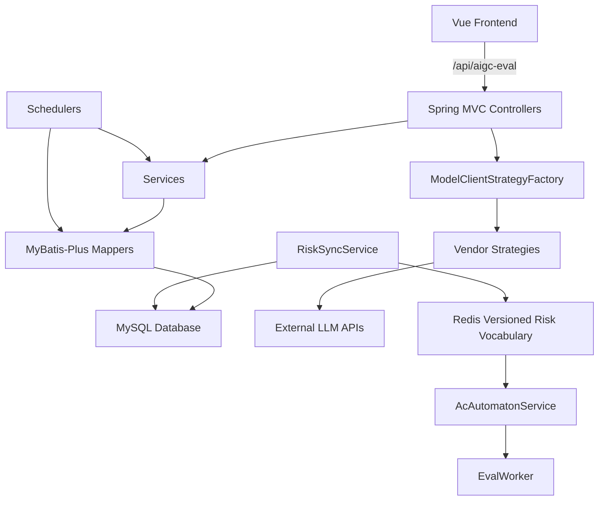
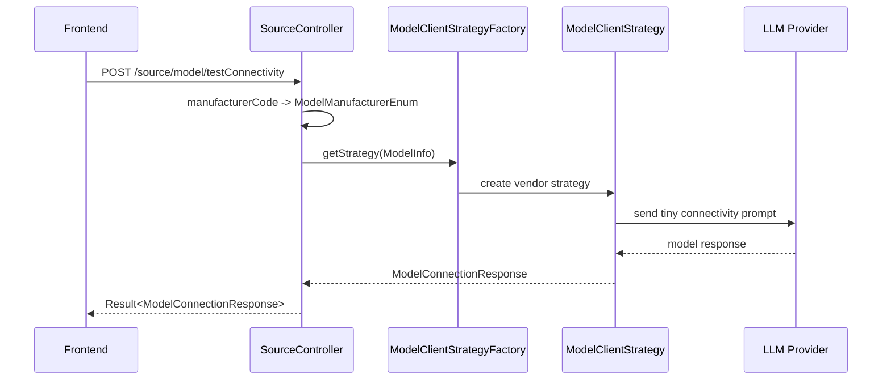
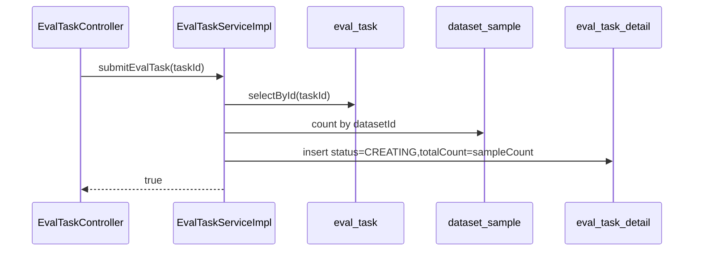
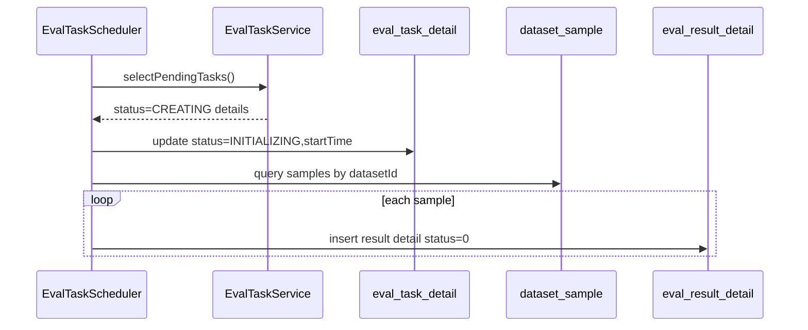
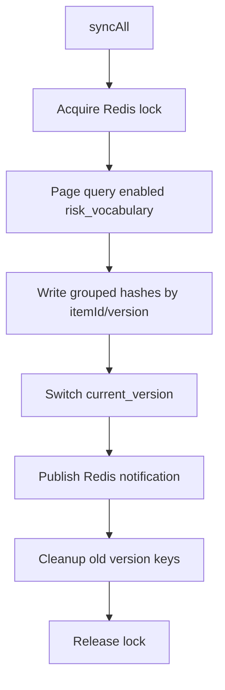
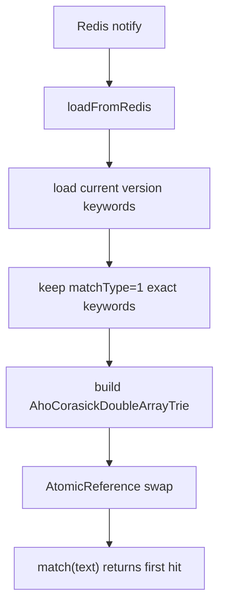

# AIGC Evaluate Code Wiki

> 生成日期：2026-06-02  
> 仓库路径：`D:\llmProject\aigc-evaluate`

## 0. 产品定位与 V1.0 蓝图

本项目面向“大模型安全评测平台”的 MVP 建设，核心目标是把安全知识库、离线批量评测、自动化红队扩充、评测大盘和模型资产管理串成一个可运营的闭环。平台不是单点的 Prompt 测试工具，而是一个面向安全运营专家的中后台系统：持续维护攻击样本与风险规则，批量调度被测模型，沉淀评测结果，并通过自动化红队把成功攻击样本回流到知识库。

V1.0 规划可以概括为五个业务域：

| 业务域 | 产品目标 | 典型能力 |
| --- | --- | --- |
| 评测知识库管理 | 维护“父子分片”结构和多路召回数据底座 | 风险场景树、攻击样本库、极速拦截字典池、Milvus/ES 索引管理 |
| 评测计划与调度 | 发起、编排和监控高并发批处理评测任务 | 测试集抽样、模型/Judge 编排、并发配置、任务看板、异常补偿 |
| 自动化红队与数据飞轮 | 自动扩充攻击样本并形成自进化闭环 | 变异模板、定时扩充任务、Generator/Validator 流程监控、审批回流 |
| 评测大盘与分析报告 | 展示评测结果并支持深度诊断 | 安全雷达图、链路溯源、PDF/Excel 报告导出 |
| 资产与系统配置 | 管理平台运行所需基础资产和权限 | 模型 API 密钥池、调用配额、轮询负载均衡、RBAC |

当前代码仓库是上述平台的早期实现骨架，已优先落在“模型资产管理”“风险词库/AC 自动机”“评测任务初始化”和“前端中后台页面雏形”几个方向；RocketMQ、Milvus、Elasticsearch、自动化红队、RBAC、报告导出等 V1.0 能力尚未真正接入。

### 规划能力与当前代码落点

| V1.0 能力 | 当前代码落点 | 当前成熟度 |
| --- | --- | --- |
| 风险场景管理 | `risk_category`, `risk_item`, `eval_interception_tag` 实体和基础 Service | 数据模型已出现，缺少管理 API 和前端左树右表 |
| 攻击样本库 | `eval_l1_interception_samples`, `dataset_info`, `dataset_sample` | 数据模型已出现，样本管理与状态流转未闭环 |
| 极速拦截字典池 | `risk_vocabulary`, `RiskSyncService`, `AcAutomatonService` | Redis 同步和 AC 匹配框架已出现，启动加载暂未启用 |
| 底层检索底座 | 依赖中暂未看到 Milvus/ES 实际接入代码 | 规划态 |
| 评测计划配置 | `eval_task`, `eval_task_detail`, `CreateEvalTaskRequest` | 任务提交和明细初始化部分完成，计划配置能力很薄 |
| 任务执行看板 | 前端 `Task.vue` 有看板雏形 | 当前主要是模拟数据 |
| 异常流水与补偿 | `eval_result_detail.errorMsg` 字段 | 数据字段已出现，补偿流程未实现 |
| 自动化红队 | 暂未看到 Generator/Validator/变异模板相关实现 | 规划态 |
| 知识回流审批 | 暂未看到审批流和向量化回写实现 | 规划态 |
| 安全大盘与报告 | 前端 `Dashboard.vue`, `Report.vue` 页面 | 页面雏形，后端报表 API/导出未实现 |
| 模型 API 密钥池 | `model_manufacturer`, `model_info`, `SourceController`, 前端模型/厂商管理页 | 基础 CRUD 已实现，需要补充密钥脱敏、配额、负载均衡 |
| RBAC | 暂未看到用户、角色、菜单、权限相关代码 | 规划态 |

## 1. 项目概览

`aigc-evaluate` 是大模型安全评测平台的前后端项目。后端负责模型配置、模型调用、评测任务调度、样本明细生成、风险词库同步与 AC 自动机匹配；前端提供任务管理、资源中心、模型管理、厂商配置、仪表盘和报告页面。

当前仓库包含两个主要目录：

| 目录 | 说明 |
| --- | --- |
| `eval/` | Spring Boot 后端模块，Maven 多模块项目中的核心模块 |
| `front/` | Vue 3 + Vite 前端项目 |

根 `pom.xml` 只声明了 `eval` Maven 模块；`front` 是独立 Node/Vite 工程，不在 Maven 构建链路内。

## 2. 技术栈

### 后端

| 技术 | 用途 |
| --- | --- |
| Java 21 | 后端运行时，代码中使用虚拟线程执行部分异步任务 |
| Spring Boot 3.5.9 | Web、配置、调度、应用启动 |
| Spring AI 1.1.0 | 大模型调用抽象，接入 DeepSeek、OpenAI、智谱、兼容 OpenAI API 的 Qwen/GPT |
| MyBatis-Plus 3.5.15 | ORM、Mapper、分页、逻辑删除、字段自动填充 |
| MySQL Connector | 当前 `application.yml` 实际配置为 MySQL 数据源 |
| Redis / Redisson | 风险词库缓存、发布订阅、同步锁 |
| HanLP Aho-Corasick | 风险词精确匹配自动机 |
| Hutool | Snowflake ID 等工具 |
| Lombok | DTO/DO 构造器和 getter/setter |

### 前端

| 技术 | 用途 |
| --- | --- |
| Vue 3 | 前端 UI 框架 |
| Vite 8 | 开发服务器和构建工具 |
| TypeScript | 类型系统 |
| Ant Design Vue | UI 组件 |
| Pinia | 状态管理 |
| Vue Router | 页面路由 |
| Axios | HTTP 请求 |
| unplugin-auto-import / unplugin-vue-components | Vue、Pinia、Ant Design Vue 自动导入 |

### 规划技术基线与当前仓库状态

产品规划中的工程基线包括 `Java 21`、`Spring AI`、`Spring Boot`、`Spring Cloud`、`MyBatis`、`MySQL`、`RocketMQ`、`Redis`、`Elasticsearch`、`Milvus` 和 `ant-design-vue`。当前仓库已体现 Java 21、Spring Boot、Spring AI、MyBatis-Plus、MySQL、Redis、ant-design-vue；尚未看到 Spring Cloud、RocketMQ、Elasticsearch、Milvus 的业务接入代码。

前端规划明确要求使用 `ant-design-vue` 构建中后台 UI，样式使用原生 CSS/Less 维护，禁止引入 UnoCSS 等原子化样式库。当前 `front` 依赖中未发现 UnoCSS。

## 3. 快速启动

### 后端

```bash
# 构建整个 Maven 项目
mvn clean package

# 构建 eval 模块
mvn clean package -pl eval

# 启动 Spring Boot 应用
mvn spring-boot:run -pl eval

# 运行 eval 模块测试
mvn test -pl eval
```

后端默认配置：

| 配置 | 值 |
| --- | --- |
| 服务端口 | `8800` |
| 上下文路径 | `/api/aigc-eval` |
| 应用名 | `aigc-eval` |

### 前端

```bash
cd front
pnpm install
pnpm dev
```

前端开发服务器默认端口为 `5173`。非 mock 模式下，Vite 会把 `/api/aigc-eval` 代理到 `http://127.0.0.1:8800`。

## 4. 后端代码地图

后端应用入口：

```text
eval/src/main/java/com/kant/llm/LLMEvalApplication.java
```

主要包结构：

| 包 | 职责 |
| --- | --- |
| `com.kant.llm.eval.controller` | REST API 控制器 |
| `com.kant.llm.eval.service` | 业务服务接口与少量服务实现 |
| `com.kant.llm.eval.service.impl` | MyBatis-Plus 服务实现 |
| `com.kant.llm.eval.dao.entity` | 数据表 DO 实体 |
| `com.kant.llm.eval.dao.mapper` | MyBatis-Plus Mapper |
| `com.kant.llm.eval.dto.req` | 请求 DTO |
| `com.kant.llm.eval.dto.resp` | 响应 VO |
| `com.kant.llm.eval.client` | 模型调用抽象、请求/响应模型、策略工厂 |
| `com.kant.llm.eval.client.strategy` | 厂商模型调用策略 |
| `com.kant.llm.eval.scheduler` | 定时任务 |
| `com.kant.llm.eval.work` | 评测执行 Worker |
| `com.kant.llm.eval.engine` | L1 拦截评测实验引擎 |
| `com.kant.llm.eval.common` | 配置、统一响应、异常、枚举、SSE、数据库元数据填充 |
| `com.kant.llm.rag` | RAG 查询改写实验入口 |

## 5. 后端架构总览



核心设计点：

1. API 返回值统一使用 `Result<T>`，成功码为 `"0"`。
2. 模型调用使用策略模式：根据 `ModelManufacturerEnum` 选择厂商策略。
3. 评测任务提交后写入 `eval_task_detail`，由定时任务轮询状态为 `CREATING` 的任务并展开样本结果。
4. 风险词库从 MySQL 分页同步到 Redis，Redis 使用版本化 key；AC 自动机从 Redis 构建精确匹配词典。
5. 前端通过 Vite 代理访问后端统一上下文路径 `/api/aigc-eval`。

## 6. 核心领域模型

### 评测任务域

| 表/实体 | 说明 | 关键字段 |
| --- | --- | --- |
| `eval_task` / `EvalTaskDO` | 评测任务主表 | `id`, `taskName`, `modelId`, `datasetId` |
| `eval_task_detail` / `EvalTaskDetailDO` | 评测任务执行明细 | `taskId`, `serialNo`, `status`, `totalCount`, `finishedCount`, `failedCount`, `startTime`, `endTime` |
| `eval_result_detail` / `EvalResultDetailDO` | 样本级评测结果 | `taskId`, `sampleId`, `inputText`, `modelOutput`, `rawResponse`, `latency`, `isSafe`, `score`, `manualScore`, `status`, `errorMsg` |

任务状态枚举 `TaskStatusEnums`：

| 状态 | code | 含义 |
| --- | ---: | --- |
| `CREATING` | 0 | 创建中，等待调度器初始化 |
| `INITIALIZING` | 1 | 初始化中 |
| `READY` | 2 | 就绪 |
| `RUNNING` | 3 | 运行中 |
| `COMPLETED` | 4 | 已完成 |
| `ERROR` | 5 | 异常 |
| `STOPPED` | 6 | 已停止 |

### 数据集域

| 表/实体 | 说明 | 关键字段 |
| --- | --- | --- |
| `dataset_info` / `DataSetDO` | 数据集信息 | `datasetName`, `datasetType`, `sampleCount`, `description` |
| `dataset_sample` / `DataSetSampleDO` | 数据集样本 | `datasetId`, `inputText`, `answerText`, `scoreRule`, `field` |

### 模型资源域

| 表/实体 | 说明 | 关键字段 |
| --- | --- | --- |
| `model_manufacturer` / `ModelManufacturerDO` | 模型厂商 | `manufacturerName`, `manufacturerCode`, `defaultBaseUrl`, `describe`, `icon`, `enable` |
| `model_info` / `ModelInfoDO` | 模型配置 | `model`, `baseUrl`, `apiKey`, `manufacturerCode`, `modelDescribe`, `maxThreadSize`, `maxCompletionTokens`, `stream`, `config`, `version` |

支持的厂商枚举：

```text
OPENAI, DEEPSEEK, QWEN, TELE, SPARK, GLM, KIMI, GPT
```

其中已在策略工厂中接入：`OPENAI`, `DEEPSEEK`, `QWEN`, `SPARK`, `GLM`, `GPT`。`TELE` 和 `KIMI` 在枚举中存在，但当前没有策略实现；`SPARK` 策略类存在，但方法返回 `null`，属于未完成实现。

### 风险词库域

| 表/实体 | 说明 | 关键字段 |
| --- | --- | --- |
| `risk_category` / `RiskCategoryDO` | 风险分类 | `categoryName`, `description`, `sortOrder`, `status` |
| `risk_item` / `RiskItemDO` | 风险项 | `categoryId`, `itemName`, `riskLevel`, `matchStrategy`, `sortOrder`, `status` |
| `risk_vocabulary` / `RiskVocabularyDO` | 风险词 | `itemId`, `keyword`, `matchType`, `exceptionWords`, `source`, `status` |

### L1 拦截样本域

| 表/实体 | 说明 | 关键字段 |
| --- | --- | --- |
| `eval_interception_tag` / `EvalInterceptionTagDO` | 拦截标签树 | `tagCode`, `tagName`, `tagDesc`, `level`, `parentId`, `enabled` |
| `eval_l1_interception_samples` / `EvalL1InterceptionSamplesDO` | L1 敏感词拦截样本 | `sampleCode`, `tagId`, `sampleType`, `promptContent`, `targetKeywords`, `expectedAction`, `version`, `status`, `extInfo` |

## 7. 核心流程

### 7.1 模型配置与连通性测试

入口：`SourceController`

主要接口：

| 方法 | 路径 | 说明 |
| --- | --- | --- |
| `POST` | `/source/manufacturer/create` | 创建厂商 |
| `PUT` | `/source/manufacturer/update` | 更新厂商 |
| `DELETE` | `/source/manufacturer/delete?id=` | 删除厂商 |
| `GET` | `/source/manufacturer/get?id=` | 查询单个厂商 |
| `GET` | `/source/manufacturer/list` | 查询厂商列表 |
| `POST` | `/source/model/create` | 创建模型配置 |
| `PUT` | `/source/model/update` | 更新模型配置 |
| `DELETE` | `/source/model/delete?id=` | 删除模型 |
| `GET` | `/source/model/get?id=` | 查询单个模型 |
| `GET` | `/source/model/list` | 查询模型列表 |
| `POST` | `/source/model/testConnectivity` | 模型连通性测试 |

连通性测试流程：



注意：

1. 策略工厂以 `modelId` 作为缓存 key；连通性测试构造的 `ModelInfo` 没有设置 `modelId`，因此会使用 `null` key 进入 `ConcurrentHashMap.compute`，这在 Java 中会触发空 key 风险，应重点检查。
2. `GptModelClientStrategy#getManufacturer()` 当前返回 `OPENAI`，不是 `GPT`。
3. `SparkModelClientStrategy` 尚未实现实际调用和连通性测试。

### 7.2 评测任务提交与样本明细初始化

入口：`EvalTaskController`

主要接口：

| 方法 | 路径 | 说明 |
| --- | --- | --- |
| `POST` | `/eval-task/create` | 创建评测任务；当前实现仅记录日志，尚未落库 |
| `POST` | `/eval-task/submit?taskId=` | 提交评测任务，生成 `EvalTaskDetailDO` |
| `GET` | `/eval-task/progress?taskId=` | 查询进度；当前方法体为空 |

提交流程：



定时初始化流程：



注意：

1. `EvalTaskScheduler` 每 1 秒执行一次。
2. 当前调度器只展开 `eval_result_detail`，没有继续调用模型生成答案，也没有把任务推进到 `READY/RUNNING/COMPLETED`。
3. `EvalTaskServiceImpl#createEvalTask` 尚未真正创建 `eval_task`。

### 7.3 单条评测执行 Worker

入口：`EvaluateController#chat`

流程：

1. 根据 `resultDetailId` 查询 `EvalResultDetailDO`。
2. 通过 `sampleId` 查询 `EvalTaskDetailDO`。
3. 通过 `modelId` 查询 `ModelInfoDO` 并转换成模型调用层的 `ModelInfo`。
4. 调用 `EvalWorker#execute`。
5. Worker 将 `modelOutput` 拆分成带重叠的文本块。
6. 依次执行三层逻辑：
   - 第一层：风险词汇匹配，调用 `AcAutomatonService#match`。
   - 第二层：`hybrid` 双路召回，占位实现。
   - 第三层：`llmAsJudge`，占位实现。

注意：

1. `EvaluateController#chat` 中用 `resultDetailDO.getSampleId()` 查询 `EvalTaskDetailDO`，从命名看可能应使用任务明细 ID，而不是样本 ID，需要结合表结构校验。
2. `EvalWorker#execute` 当前读取 `evalResultDetailDO.getModelOutput()` 进行评测，但在任务初始化阶段并没有填充模型输出。
3. Worker 尚未持久化评测结果，也未更新任务状态与耗时。

### 7.4 风险词库同步与 AC 自动机

入口：

| 入口 | 说明 |
| --- | --- |
| `RiskSyncController#syncRiskVocabulary` | 手动触发全量同步 |
| `RiskSyncScheduler#scheduledSync` | 每 2 小时触发全量同步 |
| `AcAutomatonService` | 从 Redis 加载词库并执行精确匹配 |

Redis key 设计：

| key | 说明 |
| --- | --- |
| `llm_sec:risk:current_version` | 当前词库版本 |
| `llm_sec:risk:item_keys:{version}` | 某版本下的 item key 集合 |
| `llm_sec:risk:items:{version}:{itemId}` | 某版本某风险项的词库 Hash |
| `llm_sec:risk:notify` | Redis Pub/Sub 更新通知频道 |
| `llm_sec:risk:sync_lock` | 同步锁 |
| `llm_sec:risk:items` | 旧版兼容 key |

同步流程：



AC 自动机流程：



注意：

1. `AcAutomatonService#init` 的 `@PostConstruct` 当前被注释，应用启动时不会自动加载词库，也不会注册 Redis 监听。
2. AC 自动机只加载 `matchType == 1` 的精确匹配词。
3. `match` 返回第一个命中的关键词，暂未返回命中位置、风险项、风险等级等上下文。

## 8. 模型调用策略

核心接口：`ModelClientStrategy`

```java
ModelResponse call(ModelRequest modelRequest);
ModelManufacturerEnum getManufacturer();
ModelConnectionResponse connection(ModelRequest modelRequest);
```

策略工厂：`ModelClientStrategyFactory`

| 厂商枚举 | 策略类 | 当前状态 |
| --- | --- | --- |
| `OPENAI` | `OpenAiModelClientStrategy` | 已实现 |
| `DEEPSEEK` | `DeepSeekModelClientStrategy` | 已实现 |
| `QWEN` | `QwenModelClientStrategy` | 已实现，使用 OpenAI 兼容 API |
| `GLM` | `GlmModelClientStrategy` | 已实现，使用 ZhiPuAiChatModel |
| `GPT` | `GptModelClientStrategy` | 已实现，但 `getManufacturer()` 返回 `OPENAI` |
| `SPARK` | `SparkModelClientStrategy` | 类存在，方法返回 `null` |
| `TELE` | 无 | 枚举存在，策略未接入 |
| `KIMI` | 无 | 枚举存在，策略未接入 |

调用层数据对象：

| 类 | 说明 |
| --- | --- |
| `ModelInfo` | 模型 ID、模型名、API Key、Base URL、厂商枚举 |
| `ModelRequest` | 模型信息、输入文本、Spring AI Message 列表、PromptTemplate |
| `ModelResponse` | 模型 ID、响应内容、耗时 |
| `ModelConnectionResponse` | 连通性是否成功、响应内容、耗时 |

## 9. 通用基础设施

### 统一返回

`Result<T>` 字段：

| 字段 | 说明 |
| --- | --- |
| `code` | 状态码，成功为 `"0"` |
| `message` | 响应消息 |
| `data` | 业务数据 |
| `requestId` | 请求追踪 ID，当前未看到统一填充逻辑 |

`Results` 提供成功和失败响应构造器。

### 全局异常

`GlobalExceptionHandler` 当前处理：

| 异常 | 返回 |
| --- | --- |
| `MethodArgumentNotValidException` | `CLIENT_ERROR` |
| `MaxUploadSizeExceededException` | 文件或请求体超限错误 |

默认 `Exception` 处理器当前被注释，未兜底所有异常。

### MyBatis-Plus

| 配置 | 说明 |
| --- | --- |
| `MyMetaObjectHandler` | 自动填充 `createTime`, `updateTime`, `deleted` |
| `DataBaseConfiguration` | 注册分页插件和元对象填充器 |

注意：`DataBaseConfiguration` 中分页插件使用 `DbType.POSTGRE_SQL`，但当前依赖和 `application.yml` 实际使用 MySQL。建议统一为真实数据库类型。

### SSE

`SseEmitterSender` 封装了 Spring `SseEmitter`，提供线程安全发送、完成、错误完成能力。目前代码中暂未看到业务控制器实际接入。

## 10. 前端代码地图

前端入口：

| 文件 | 说明 |
| --- | --- |
| `front/src/main.ts` | Vue 应用入口 |
| `front/src/App.vue` | 根组件 |
| `front/src/router/index.ts` | 路由配置 |
| `front/src/api/request.ts` | Axios 实例与响应拦截 |
| `front/src/api/*.ts` | 业务 API 封装 |
| `front/src/types/*.ts` | 前端类型定义 |
| `front/src/stores/*.ts` | Pinia 状态 |
| `front/src/views/**` | 页面组件 |
| `front/src/assets/global.css` | 全局样式 |

路由：

| 路径 | 页面 |
| --- | --- |
| `/home` | 首页 |
| `/dashboard` | 仪表盘 |
| `/task` | 任务管理 |
| `/report` | 报告 |
| `/resource/vendor` | 厂商配置 |
| `/resource/model` | 模型管理 |

前端请求封装：

1. Axios `baseURL` 为 `/api/aigc-eval`。
2. 超时时间为 30 秒。
3. 响应拦截器认为 `code === "0"` 或 `code === "200"` 为成功。
4. 失败时通过 Ant Design Vue `message.error` 展示错误。

前端主要 API：

| 文件 | 后端路径 |
| --- | --- |
| `api/manufacturer.ts` | `/source/manufacturer/*` |
| `api/model.ts` | `/source/model/*` |
| `api/eval-task.ts` | `/eval-task/*` |

## 11. API 总表

所有后端接口默认带上下文路径：

```text
/api/aigc-eval
```

### 资源中心

| 方法 | 路径 | 返回 |
| --- | --- | --- |
| `POST` | `/source/manufacturer/create` | `Result<ModelManufacturerVO>` |
| `PUT` | `/source/manufacturer/update` | `Result<ModelManufacturerVO>` |
| `DELETE` | `/source/manufacturer/delete?id=` | `Result<Void>` |
| `GET` | `/source/manufacturer/get?id=` | `Result<ModelManufacturerVO>` |
| `GET` | `/source/manufacturer/list` | `Result<List<ModelManufacturerVO>>` |
| `POST` | `/source/model/create` | `Result<ModelInfoVO>` |
| `PUT` | `/source/model/update` | `Result<ModelInfoVO>` |
| `DELETE` | `/source/model/delete?id=` | `Result<Void>` |
| `GET` | `/source/model/get?id=` | `Result<ModelInfoVO>` |
| `GET` | `/source/model/list` | `Result<List<ModelInfoVO>>` |
| `POST` | `/source/model/testConnectivity` | `Result<ModelConnectionResponse>` |

### 评测任务

| 方法 | 路径 | 返回 |
| --- | --- | --- |
| `POST` | `/eval-task/create` | 当前方法返回 `void`，没有统一 `Result` |
| `POST` | `/eval-task/submit?taskId=` | `Result<Boolean>` |
| `GET` | `/eval-task/progress?taskId=` | 当前未实现 |

### 评测执行

| 方法 | 路径 | 返回 |
| --- | --- | --- |
| `GET` | `/evaluate/chat?resultDetailId=` | `Result<Void>` |

### 风险词库

| 方法 | 路径 | 返回 |
| --- | --- | --- |
| `POST` | `/risk/sync` | `String` |

### 测试/实验

| 方法 | 路径 | 说明 |
| --- | --- | --- |
| `GET` | `/test/testModelClient` | 测试策略工厂 |
| `GET` | `/test/test?keyWord=` | 测试 AC 自动机匹配 |
| - | `/rag/rewrite` | 仅定义 Controller 和 Prompt 常量，暂未暴露业务方法 |

## 12. 当前已知缺口和风险

### V1.0 规划落地缺口

1. 知识库管理缺少完整的风险树管理、攻击样本左树右表、标签化、审核/生效/失效状态流转。
2. 底层检索底座尚未接入 Milvus 和 Elasticsearch，也没有索引状态查看、重建、监控接口。
3. 评测计划配置仍停留在简单 `taskName/modelId/datasetId`，缺少按比例/标签抽样、Judge LLM、召回阈值、并发线程数等编排参数。
4. 调度侧尚未接入 RocketMQ，当前通过 Spring `@Scheduled` 轮询任务明细，缺少队列堆积、Worker 活跃数、暂停/恢复/中止等作战看板能力。
5. 自动化红队模块尚未出现，缺少变异模板库、Generator/Validator、定时扩充任务、Bad Case 抽样和知识回流审批。
6. 报告域目前主要是前端页面雏形，缺少安全雷达图数据接口、链路溯源详情、PDF/Excel 导出。
7. 系统配置缺少 RBAC、用户/角色/菜单权限、调用配额和模型 API Key 轮询负载均衡。

### 安全配置

1. `application.yml` 当前包含真实数据库、Redis 连接信息，应迁移到环境变量、配置中心或本地未提交配置文件。
2. `TestController` 中存在硬编码测试 API Key，应移除或改为环境变量注入。
3. 模型 API Key 会从后端 `ModelInfoVO` 原样返回给前端，建议按权限控制或脱敏返回。

### 后端实现缺口

1. `EvalTaskServiceImpl#createEvalTask` 只写日志，未创建任务主记录。
2. `EvalTaskController#createEvalTask` 返回 `void`，没有统一响应包装。
3. `EvalTaskController#getEvalTaskProgress` 未实现。
4. 缺少 `/eval-task/list` 后端接口，但前端已经调用。
5. `EvalTaskScheduler` 初始化样本结果后，没有推进任务状态或触发模型调用。
6. `EvalWorker` 的二层召回、三层 LLM Judge、结果持久化和状态更新仍为空。
7. `AcAutomatonService#init` 没有 `@PostConstruct`，启动时不会自动构建 AC 自动机。
8. `ModelClientStrategyFactory` 可能用 `null` modelId 作为缓存 key，连通性测试会受影响。
9. `SparkModelClientStrategy` 未实现，`TELE/KIMI` 未接入策略工厂。
10. `DataBaseConfiguration` 的分页数据库类型与当前 MySQL 配置不一致。
11. 默认全局异常兜底处理被注释，运行时异常可能返回非统一格式。

### 前后端契约差异

1. 前端 `submitEvalTask` 使用 `GET /eval-task/submit`，后端实际是 `POST /eval-task/submit`。
2. 前端调用 `/eval-task/list`，后端当前没有该接口。
3. 前端任务页面 `Task.vue` 当前主要使用模拟数据，并未真正接入任务列表 API。
4. 前端响应拦截器接受 `"200"` 成功码，但后端统一成功码是 `"0"`。

### 工程质量

1. 多个中文注释或页面文本在当前文件中显示为乱码，建议统一文件编码为 UTF-8 并清理受损文本。
2. 后端测试目前以模型策略/RAG 实验测试为主，缺少任务提交、风险词同步、API 控制器、前后端契约测试。
3. `front` 同时存在 `package-lock.json` 和 `pnpm-lock.yaml`，但 `packageManager` 指向 pnpm，建议统一包管理器。

## 13. 推荐维护路线

优先级建议：

1. 先处理安全配置：移除明文密钥、数据库密码、Redis 密码和测试 Key。
2. 补齐前后端最小闭环：`create task -> list task -> submit task -> progress`。
3. 修复接口契约：统一 HTTP 方法、返回格式和成功码。
4. 完成评测执行链路：样本明细生成后调用模型，写回 `modelOutput/rawResponse/latency`。
5. 启用并验证 AC 自动机启动加载和 Redis 监听。
6. 完成 Worker 的三层评测和结果落库。
7. 为 `RiskSyncService`、`ModelClientStrategyFactory`、`EvalTaskServiceImpl` 增加单元测试。
8. 整理前端乱码文本和真实 API 接入。

## 14. 关键文件索引

| 文件 | 说明 |
| --- | --- |
| `pom.xml` | Maven 父项目配置 |
| `eval/pom.xml` | 后端模块依赖 |
| `eval/src/main/resources/application.yml` | 后端运行配置 |
| `eval/src/main/java/com/kant/llm/LLMEvalApplication.java` | Spring Boot 入口 |
| `eval/src/main/java/com/kant/llm/eval/controller/SourceController.java` | 厂商和模型管理 API |
| `eval/src/main/java/com/kant/llm/eval/controller/EvalTaskController.java` | 评测任务 API |
| `eval/src/main/java/com/kant/llm/eval/controller/EvaluateController.java` | 手动触发单条评测 |
| `eval/src/main/java/com/kant/llm/eval/service/impl/EvalTaskServiceImpl.java` | 评测任务提交逻辑 |
| `eval/src/main/java/com/kant/llm/eval/scheduler/EvalTaskScheduler.java` | 评测任务定时初始化 |
| `eval/src/main/java/com/kant/llm/eval/work/EvalWorker.java` | 样本评测 Worker |
| `eval/src/main/java/com/kant/llm/eval/service/RiskSyncService.java` | 风险词库同步 |
| `eval/src/main/java/com/kant/llm/eval/service/AcAutomatonService.java` | AC 自动机匹配 |
| `eval/src/main/java/com/kant/llm/eval/client/ModelClientStrategyFactory.java` | 模型策略工厂 |
| `front/package.json` | 前端依赖和脚本 |
| `front/vite.config.ts` | Vite 插件和代理配置 |
| `front/src/api/request.ts` | Axios 请求封装 |
| `front/src/router/index.ts` | 前端路由 |
| `front/src/views/resource/ModelManage.vue` | 模型管理页面 |
| `front/src/views/resource/VendorConfig.vue` | 厂商配置页面 |
| `front/src/views/Task.vue` | 任务管理页面 |
