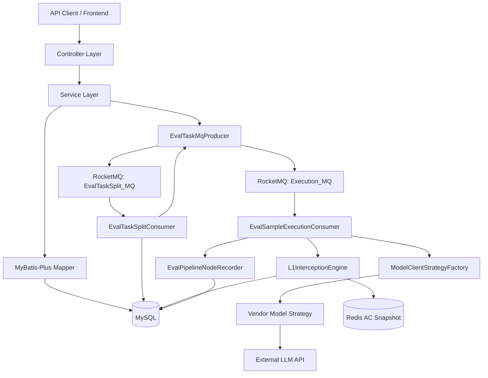
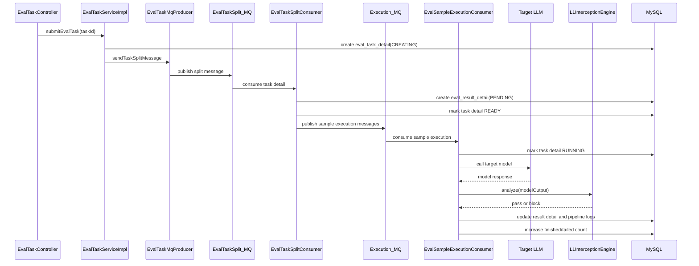

# AIGC Evaluate

`aigc-evaluate` 是一个大模型安全评测平台后端项目。它用于管理被测模型、评测数据集和风险词库，并通过 RocketMQ 异步执行评测任务：批量调用目标大模型，记录样本级输出，再使用 L1 风险词 AC 自动机对模型回复进行快速安全判定。

当前仓库是 Maven 多模块项目，但父项目目前只声明了 `eval` 后端模块。

## 核心能力

| 能力 | 说明 |
| --- | --- |
| 模型资源管理 | 管理模型厂商、模型配置、API Key、Base URL，并支持模型连通性测试 |
| 数据集管理 | 管理评测数据集基础信息，查询数据集样本 |
| 评测任务管理 | 支持任务分页、提交、停止、状态查询、批次查询、样本结果查询 |
| 异步任务执行 | 使用 RocketMQ 将任务拆分和单样本执行解耦 |
| 模型调用策略 | 通过 `ModelClientStrategy` 接入 OpenAI、DeepSeek、Qwen、GLM、GPT 等厂商策略 |
| L1 风险词拦截 | 使用 Redis 快照和 Aho-Corasick 自动机进行高性能字面量风险词判定 |
| 流水线节点日志 | 记录模型调用、L1 判定等节点的输入、输出、耗时和状态 |
| 认证能力 | 使用 Sa-Token 提供登录和登出接口 |

## 技术栈

| 类型 | 技术 |
| --- | --- |
| 语言与运行时 | Java 21 |
| Web 框架 | Spring Boot 3 |
| ORM | MyBatis-Plus |
| 数据库 | MySQL |
| 缓存与分布式锁 | Redis、Redisson |
| 消息队列 | RocketMQ |
| 模型调用 | Spring AI、OpenAI/DeepSeek/ZhipuAI/DashScope 相关集成 |
| 安全词匹配 | Aho-Corasick Double Array Trie、HanLP |
| 认证 | Sa-Token |
| 工具库 | Hutool、Lombok、Fastjson2、Jackson、Apache Commons |

## 项目结构

```text
aigc-evaluate/
  pom.xml                         Maven 父项目
  eval/                           Spring Boot 后端模块
    pom.xml                       后端模块依赖
    src/main/java/com/kant/llm/
      LLMEvalApplication.java     应用启动入口
      eval/
        controller/               REST API 控制器
        service/                  业务服务接口和节点记录器
        service/impl/             业务服务实现
        dao/entity/               MyBatis-Plus DO 实体
        dao/mapper/               MyBatis-Plus Mapper
        dto/req/                  请求 DTO
        dto/resp/                 响应 VO
        client/                   模型调用抽象、请求响应对象、策略工厂
        client/strategy/          厂商模型调用策略
        engine/                   L1 风险词拦截引擎和 AC 快照模型
        mq/                       RocketMQ Topic、消息体、生产者、消费者
        scheduler/                定时任务扩展点
        common/                   配置、统一响应、异常、枚举、Web 工具
    src/main/resources/
      application.yml             应用运行配置
```

## 整体架构



## 评测任务流程



流程说明：

1. 提交任务后，系统创建一次执行批次 `eval_task_detail`。
2. 任务拆分消费者读取数据集样本，为每条样本生成 `eval_result_detail`。
3. 单样本执行消费者调用被测模型，并记录 `MODEL_CALL` 节点。
4. 模型输出进入 `L1InterceptionEngine`，使用 AC 自动机做风险词判定。
5. 系统写回样本结果、流水线节点日志，并推进批次进度。

## 主要接口入口

所有接口默认带上下文路径：

```text
/api/aigc-eval
```

| 模块 | Base Path | 说明 |
| --- | --- | --- |
| 认证 | `/auth` | 登录、登出 |
| 模型资源 | `/source` | 模型厂商、模型配置、连通性测试 |
| 数据集 | `/data-set` | 数据集 CRUD、样本列表和分页 |
| 评测任务 | `/eval-task` | 提交、停止、分页、状态、结果、流水线日志 |
| 风险词库 | `/risk/vocabularies` | 风险词管理、AC 快照发布 |
| 风险场景 | `/risk/scenarios` | 风险场景管理 |
| 风险分类 | `/risk/category` | 风险分类和风险明细管理 |

## 快速启动

### 构建项目

```bash
mvn clean package
```

只构建后端模块：

```bash
mvn clean package -pl eval
```

### 启动后端

```bash
mvn spring-boot:run -pl eval
```

默认服务地址：

```text
http://localhost:8800/api/aigc-eval
```

### 运行测试

```bash
mvn test -pl eval
```

运行单个测试类：

```bash
mvn test -pl eval -Dtest=ModelClientStrategyTest
```

运行单个测试方法：

```bash
mvn test -pl eval -Dtest=ModelClientStrategyTest#test
```

## 运行依赖

启动和完整执行评测链路前，需要确保以下外部服务可用：

- MySQL：保存模型、数据集、任务、结果和风险词等业务数据。
- Redis：用于 Redisson 分布式锁、AC 自动机快照、Sa-Token 支持。
- RocketMQ：用于任务拆分和单样本异步执行。
- 外部大模型 API：用于模型连通性测试和评测执行。

## 当前实现状态

当前代码已经形成后端评测主链路，但仍有一些需要注意的实现边界：

- `EvalTaskServiceImpl#createEvalTask` 当前只记录日志，尚未真正创建 `eval_task` 主记录。
- `/eval-task/progress` 当前方法体为空，建议使用 `/eval-task/status` 和 `/eval-task/result/page` 查询状态与结果。
- 当前安全判定链路已实现模型调用和 L1 风险词拦截；L2 双路召回、L3 Judge LLM 仍是预留能力，尚未接入执行链路。
- `ModelManufacturerEnum` 中存在 `TELE`、`KIMI`，但策略工厂当前未接入对应策略。
- 当前仓库未包含可运行的前端模块，主要实现集中在 `eval` 后端模块。
- `application.yml` 中包含外部服务连接配置，生产环境建议改为环境变量、配置中心或本地 profile 管理。

## 更多文档

更完整的 Code Wiki 位于：

- [doc/wiki/README.md](doc/wiki/README.md)

其中包含项目整体架构、模块职责、领域模型、关键类与函数、API 总览、依赖配置、运行手册和当前缺口说明。
