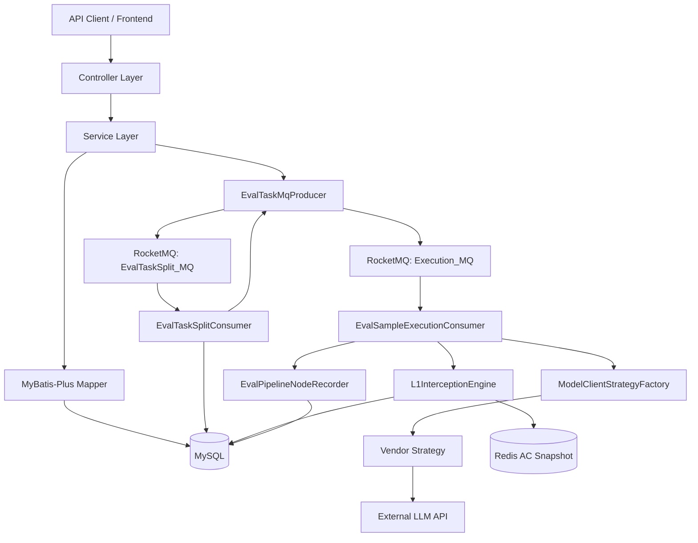
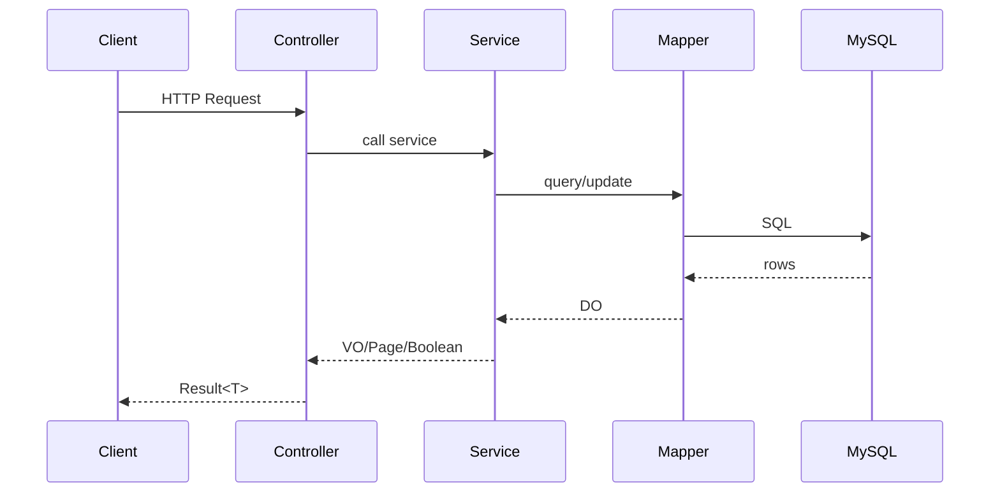
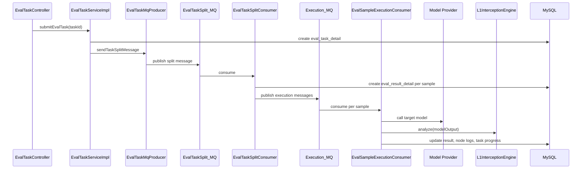
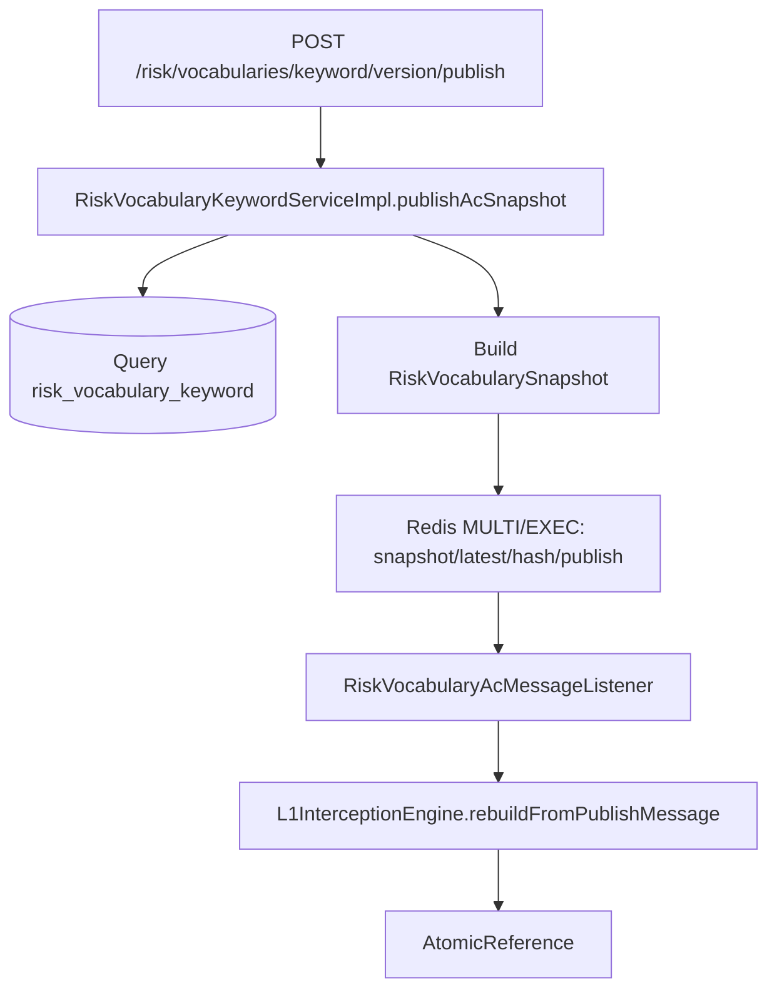
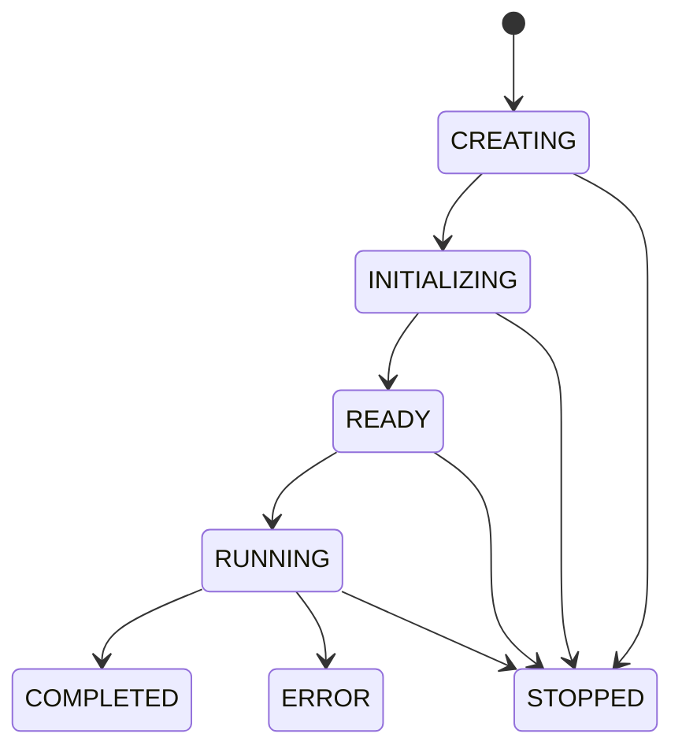
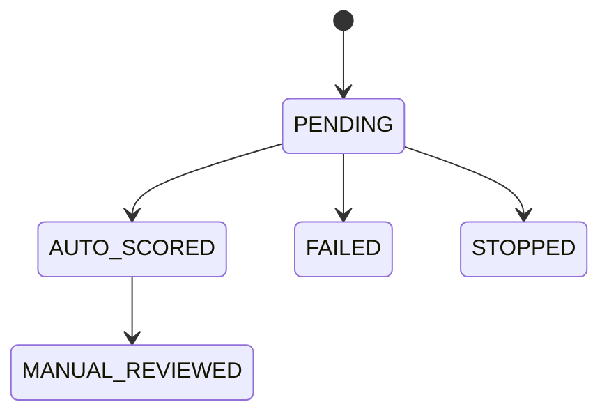

# Architecture

## 整体架构

当前后端采用典型 Spring Boot 分层结构，并通过 RocketMQ 解耦评测任务的批量执行。

## 分层说明

| 层 | 主要包 | 职责 |
| --- | --- | --- |
| API 层 | `controller` | 暴露 REST API，做请求参数接收和响应包装 |
| 业务层 | `service`, `service.impl` | 任务提交、查询、停止、风险词发布等业务逻辑 |
| 持久层 | `dao.entity`, `dao.mapper` | MyBatis-Plus 实体和 Mapper |
| 模型调用层 | `client`, `client.strategy` | 统一模型请求/响应对象和厂商策略 |
| 评测引擎 | `engine` | L1 风险词拦截和 AC 自动机热更新 |
| 消息层 | `mq` | RocketMQ topic、消息体、生产者、消费者 |
| 公共基础设施 | `common` | 统一响应、异常、枚举、配置、Web 工具 |

## 请求链路

普通查询和管理接口走同步链路：

## 评测执行链路

评测任务提交后进入异步链路：

## 风险词库发布与热更新

应用启动时，`L1InterceptionEngine#init` 会优先从 Redis latest 快照加载 AC 自动机；Redis 快照不可用时，从 DB 中 `syncStatus=true` 的风险词兜底构建。

## 状态流转

评测批次状态：

样本结果状态：

