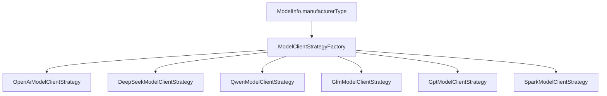

# Key Flows

## 1. 创建评测任务

入口：`POST /api/aigc-eval/eval-task/create`

当前 Controller 调用 `EvalTaskService#createEvalTask`，但 `EvalTaskServiceImpl#createEvalTask` 只记录日志，未写入 `eval_task`。因此当前真实可用的评测执行依赖数据库中已有 `eval_task` 记录。

## 2. 提交评测任务

入口：`POST /api/aigc-eval/eval-task/submit?taskId=...`

核心方法：`EvalTaskServiceImpl#submitEvalTask`

流程：

1. 使用 Redisson 锁 `aigc-eval:eval-task:operation:{taskId}` 防止重复提交。
2. 查询 `eval_task`，任务不存在则抛出 `ServiceException`。
3. 检查是否已有活跃批次。活跃状态包括 `CREATING`、`INITIALIZING`、`READY`、`RUNNING`。
4. 统计数据集样本数量，样本数为空或 0 时拒绝启动。
5. 使用 Hutool Snowflake 生成 `taskDetailId` 和 `serialNo`。
6. 插入 `eval_task_detail`，状态为 `CREATING`。
7. 发送 `EvalTaskSplitMessage` 到 `EvalTaskSplit_MQ`。
8. 发送失败时，将批次状态更新为 `ERROR`。

## 3. 任务拆分

Topic：`EvalTaskSplit_MQ`

消费者：`EvalTaskSplitConsumer#onMessage`

流程：

1. 根据 `taskDetailId` 查询执行批次。
2. 如果批次已是 `READY` 或 `RUNNING`，补发仍处于 `PENDING` 的样本执行消息。
3. 如果批次已是 `COMPLETED`、`ERROR`、`STOPPED`，跳过重复拆分。
4. 将批次状态改为 `INITIALIZING`，记录 `startTime`。
5. 查询批次对应数据集的全部样本。
6. 为每个样本幂等创建 `eval_result_detail`，初始状态为 `PENDING`。
7. 再次检查批次是否被用户停止。
8. 将批次状态改为 `READY`，更新 `totalCount`。
9. 为每条结果明细发送 `EvalSampleExecutionMessage` 到 `Execution_MQ`。

拆分阶段通过先查后插和 `DuplicateKeyException` 兜底处理重复消息。

## 4. 单样本执行

Topic：`Execution_MQ`

消费者：`EvalSampleExecutionConsumer#onMessage`

流程：

1. 使用 Redisson 锁 `aigc-eval:eval-result:execute:{resultDetailId}` 防止同一样本并发执行。
2. 查询 `eval_result_detail`，不存在则跳过。
3. 如果样本结果已经是终态，直接跳过。终态包括 `AUTO_SCORED`、`MANUAL_REVIEWED`、`FAILED`、`STOPPED`。
4. 调用 `executeSample` 执行业务流程。
5. 成功后更新结果并推进批次进度。
6. 失败后写入失败状态并推进批次失败计数。

`executeSample` 内部核心步骤：

1. 查询 `eval_task_detail`。
2. 如果批次已停止，记录模型调用节点为 `STOPPED` 并返回。
3. 将批次从 `READY` 推进到 `RUNNING`。
4. 加载 `ModelInfoDO` 并转换为模型调用层 `ModelInfo`。
5. 通过 `ModelClientStrategyFactory` 获取厂商策略。
6. 记录 `MODEL_CALL` 节点开始日志。
7. 调用被测模型。
8. 记录 `MODEL_CALL` 节点通过或失败。
9. 执行 L1 判定。
10. 批次未停止时，返回待落库的成功结果。

## 5. 模型调用

核心类型：

- `ModelInfo`
- `ModelRequest`
- `ModelResponse`
- `ModelClientStrategy`
- `ModelClientStrategyFactory`

策略选择：

模型调用结果会写入：

- `eval_result_detail.modelOutput`
- `eval_result_detail.rawResponse`
- `eval_result_detail.latency`

## 6. L1 风险词拦截

核心方法：`L1InterceptionEngine#analyze`

流程：

1. 创建 `EvalContext`。
2. 如果输入为空，直接返回空上下文。
3. 从 `AtomicReference<AcAutomatonContext>` 获取当前生效 Trie。
4. 使用 Aho-Corasick 扫描模型输出。
5. 命中 `riskLevel=1` 时：
   - 标记 `context.l1Blocked=true`。
   - 抛出 `SecurityBlockException`。
   - 最终样本 `isSafe=false`。
   - L1 节点状态为 `BLOCKED`。
6. 命中 `riskLevel=2` 时：
   - 加入 warning tag。
   - 不直接拦截。
7. 未命中拦截时：
   - 当前版本先按安全处理。
   - L1 节点状态为 `PASSED`。

## 7. 风险词发布

入口：`POST /api/aigc-eval/risk/vocabularies/keyword/version/publish`

核心方法：`RiskVocabularyKeywordServiceImpl#publishAcSnapshot`

流程：

1. 使用 Redisson 发布锁避免并发发布。
2. 查询全部未删除风险词。
3. 转换为稳定快照项。
4. 计算快照 hash。
5. 如果 hash 和 Redis latest hash 一致，直接收敛 DB `syncStatus`。
6. 生成新版本号。
7. 写入 Redis：
   - 快照内容
   - latest version
   - latest hash
   - Pub/Sub 通知
8. 将未删除词条标记为已同步。

## 8. 批次停止

入口：`POST /api/aigc-eval/eval-task/stop?taskId=...`

核心方法：`EvalTaskServiceImpl#stopEvalTask`

流程：

1. 使用任务操作锁防止并发停止/提交。
2. 查询当前活跃批次。
3. 没有活跃批次时返回成功。
4. 将活跃批次状态改为 `STOPPED`，写入 `endTime`。
5. 将该批次下仍为 `PENDING` 的结果明细改为 `STOPPED`。

已经进入模型调用的样本无法强制中断；模型返回后消费者会再次检查批次状态，若已停止则丢弃后续成功结果，不继续推进 L1 或最终落库。

## 9. 进度推进

核心方法：`EvalSampleExecutionConsumer#increaseTaskProgress`

成功或失败结果落库后：

1. 用 SQL 原子递增 `finished_count`。
2. 失败时同时递增 `failed_count`。
3. 回查批次。
4. 当 `finishedCount >= totalCount`：
   - `failedCount=0` 时批次改为 `COMPLETED`。
   - `failedCount>0` 时批次改为 `ERROR`。
   - 写入 `endTime`。
