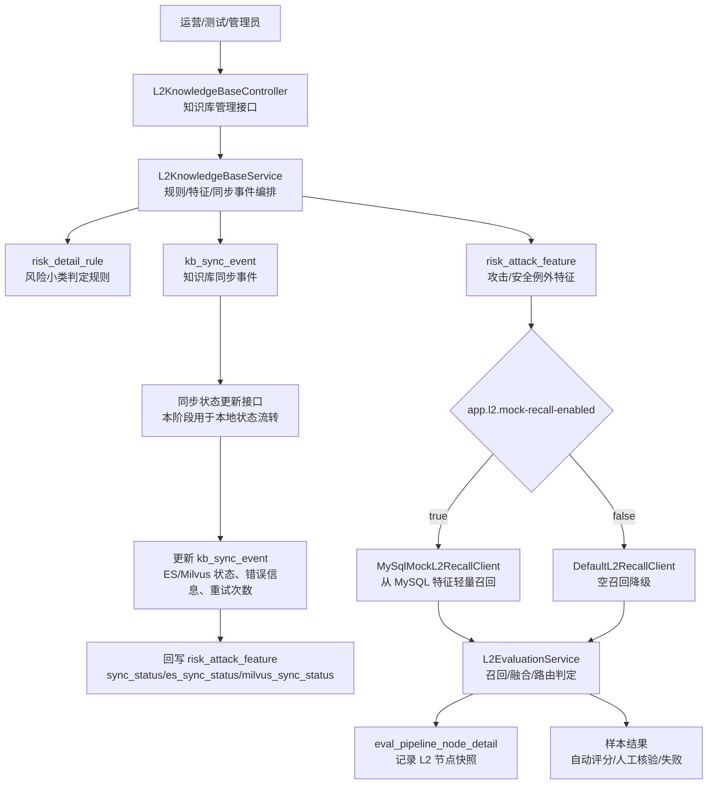
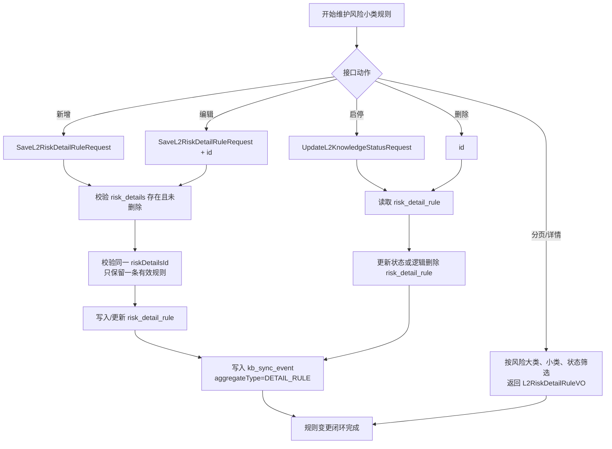
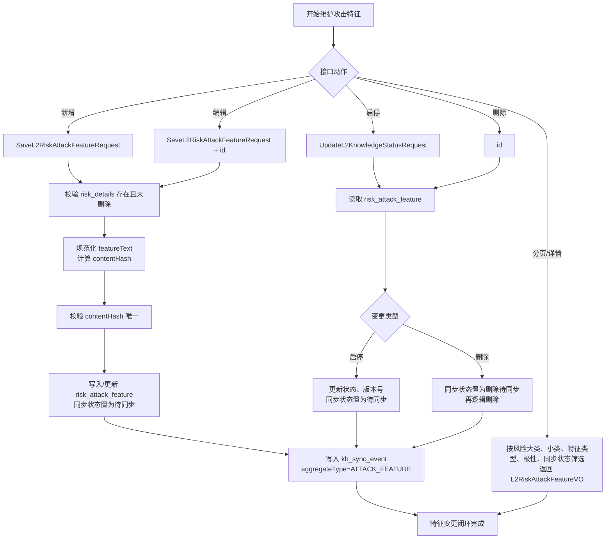
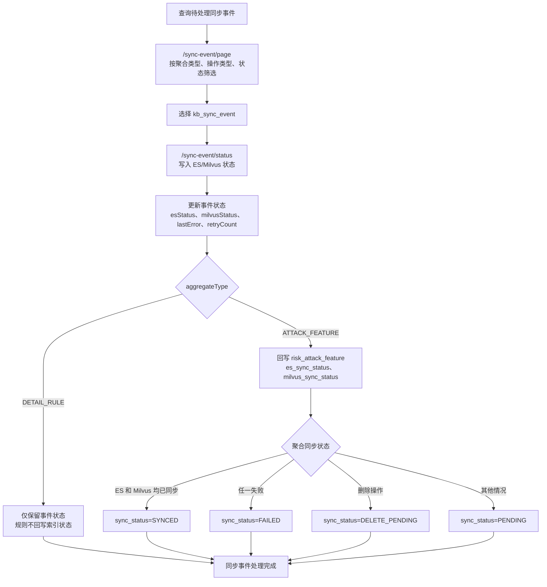
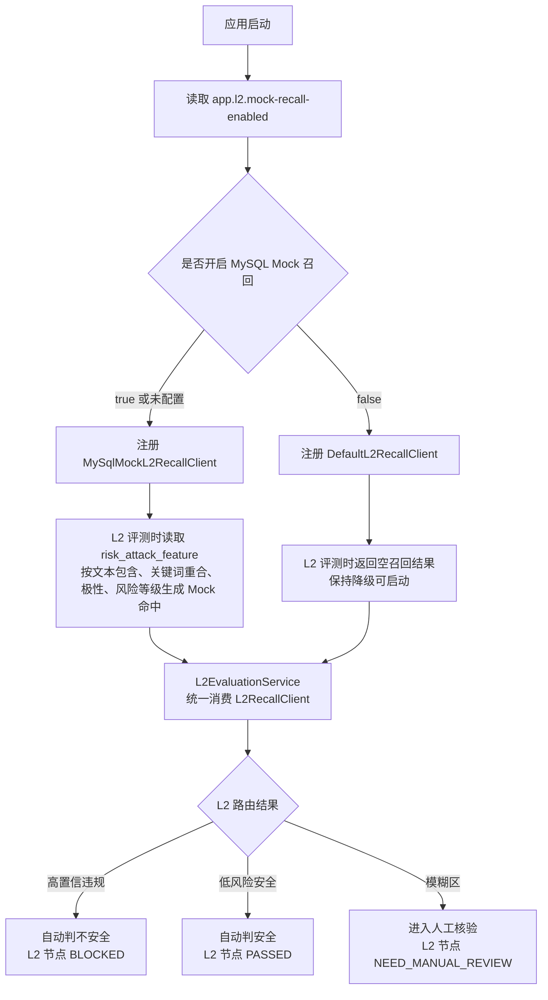
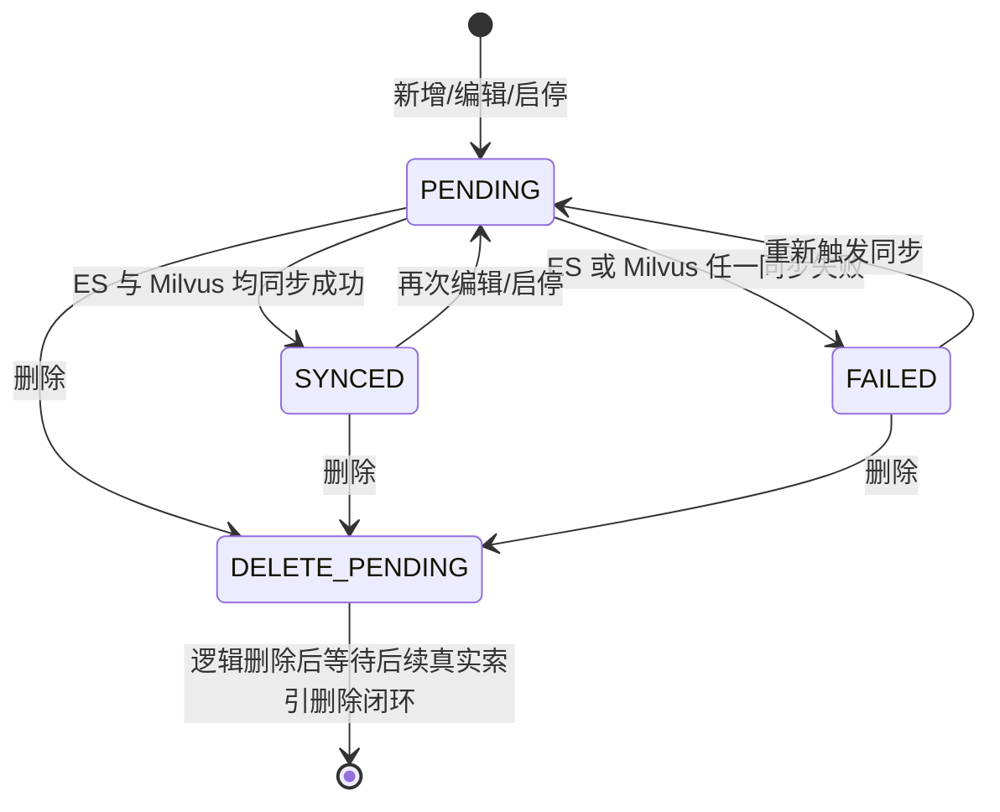

# L2 知识库整改流程图

本文档描述本次整改的闭环：把 L2 从“可运行 Mock 链路”推进到“可维护、可同步、可观测的知识库链路”。核心范围包括知识库管理接口、同步事件、索引同步状态回写，以及 MySQL Mock 召回开关。

## 1. 本次整改总览

## 2. 规则维护流程

## 3. 攻击特征维护流程

## 4. 同步事件与状态回写流程

## 5. Mock 召回开关流程

## 6. 攻击特征同步状态流转

## 7. 本次整改边界

- MySQL 仍是唯一事实源，ES 和 Milvus 仍未接真实服务。
- 本阶段通过同步事件和状态字段先打通“可观测、可回写”的本地闭环。
- MySQL Mock 召回用于开发验证，可通过 `app.l2.mock-recall-enabled` 切换。
- L2 主流程继续通过 `L2RecallClient` 抽象消费召回结果，后续替换真实 ES/Milvus 客户端时不需要改 L2 主流程。
- L3 Judge 暂未进入本次整改范围，模糊区仍进入人工核验。
