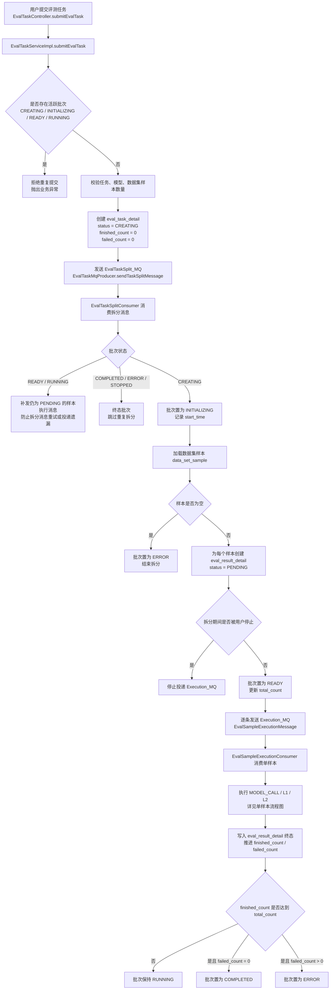
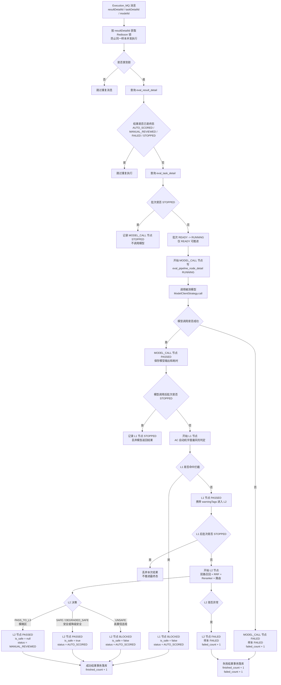
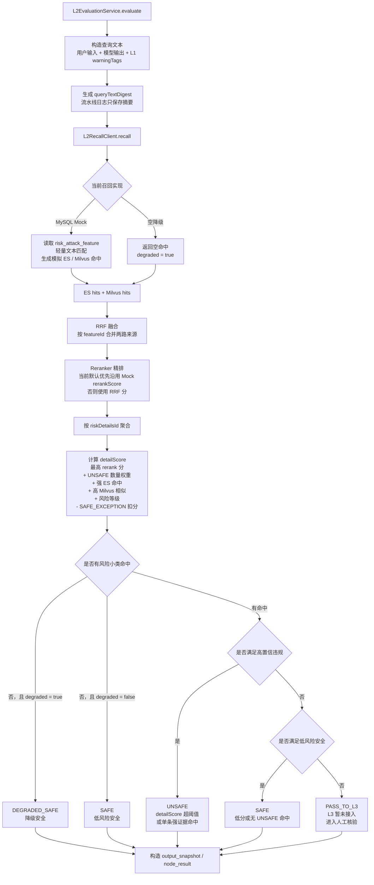
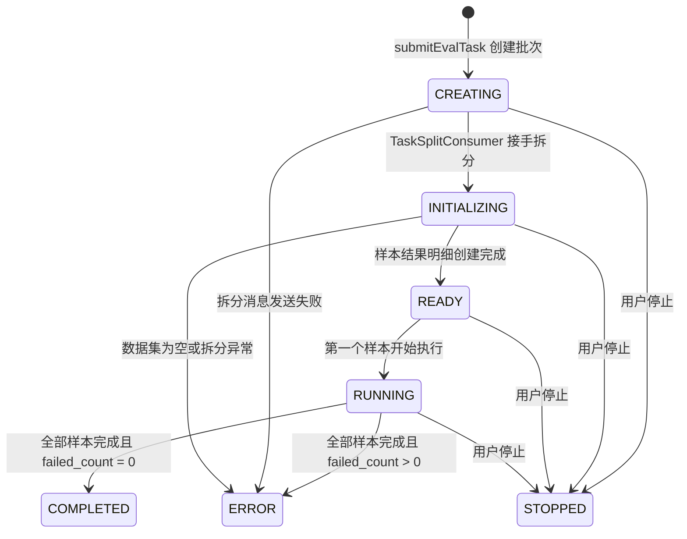
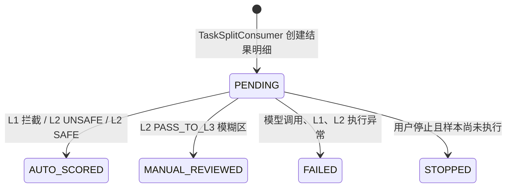
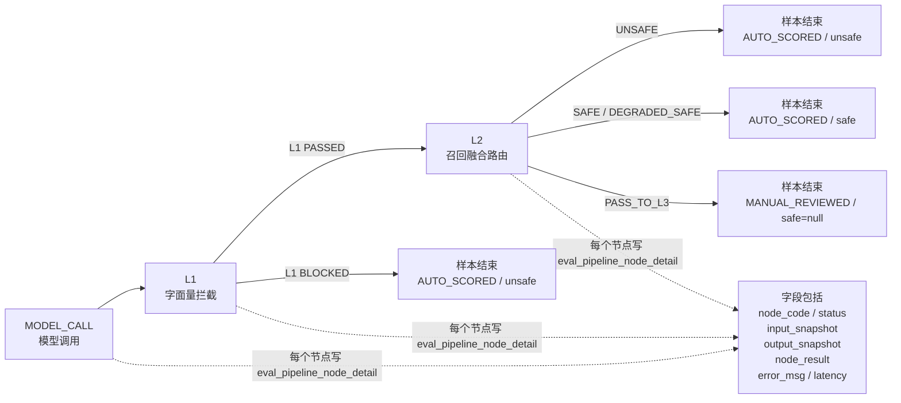
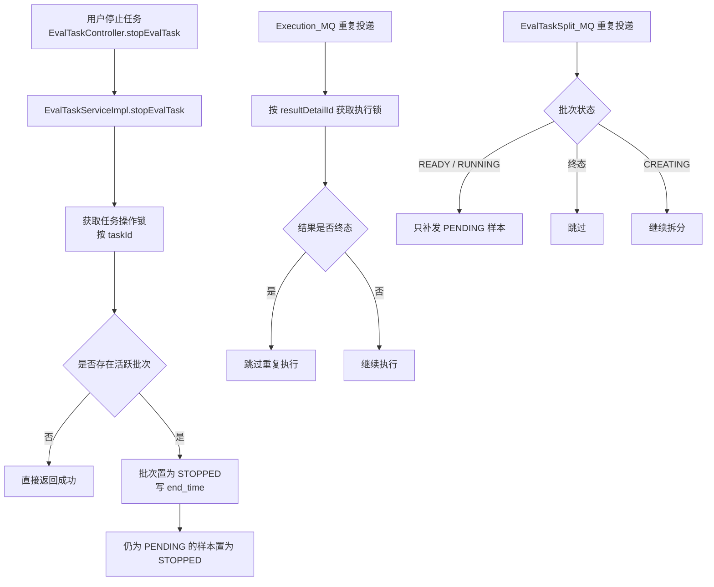

# 评测流水线流程图

本文档描述当前后端评测流水线的完整执行路径，覆盖任务提交、批次拆分、单样本执行、L1/L2 安全判定、批次进度推进、用户停止和流水线节点日志。

## 总览流程

## 单样本执行流程

## L2 内部判定流程

## 状态流转

### 批次状态 eval_task_detail.status

### 样本状态 eval_result_detail.status

## 流水线节点日志

## 停止与幂等控制

## 当前阶段边界

- L1 已接入 AC 自动机字面量拦截。
- L2 已接入召回、RRF、Reranker 降级和阈值路由。
- 当前 MySQL Mock 召回用于无 ES/Milvus 数据时验证链路。
- L3 Judge LLM 暂未实现，L2 `PASS_TO_L3` 结果会进入人工核验。
- `eval_pipeline_node_detail` 是排查单样本执行过程的主要日志表。
