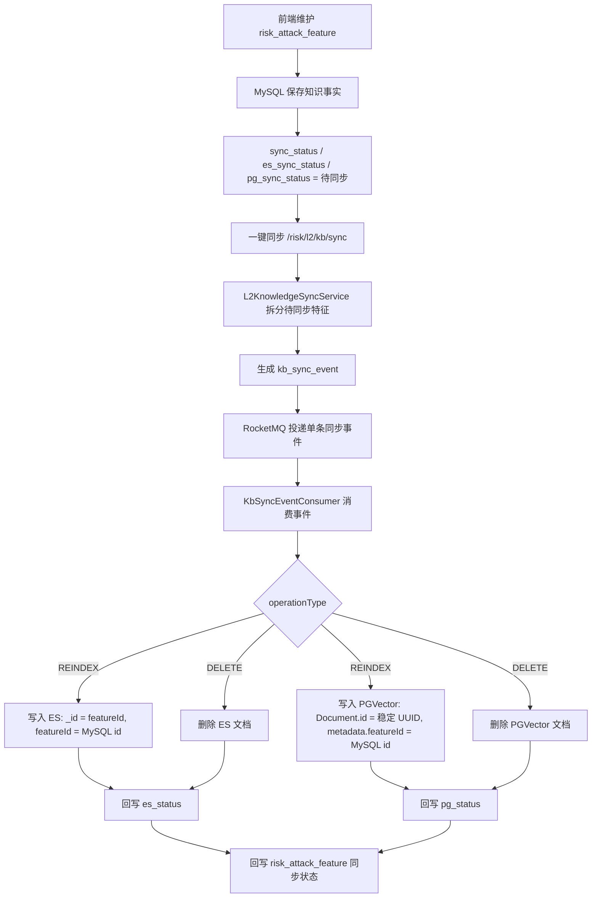
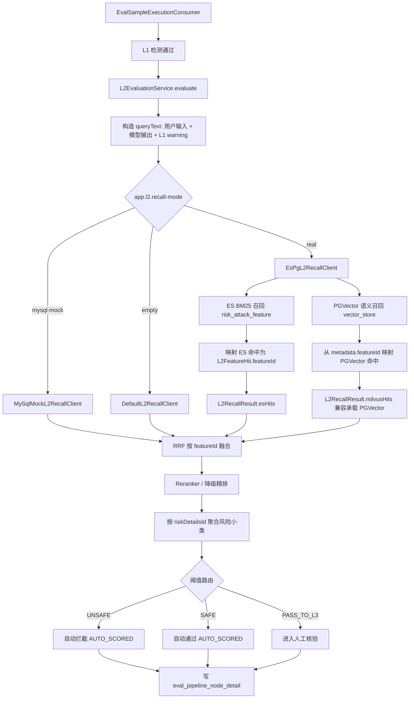

# L2 真实 ES + PGVector 混合召回流程

## 知识库同步链路



## L2 评测执行链路



## ID 对齐约定

```text
MySQL:
  risk_attack_feature.id = 统一 featureId

ES:
  _id = String.valueOf(featureId)
  featureId = MySQL risk_attack_feature.id

PGVector:
  Document.id = UUID.nameUUIDFromBytes("l2-risk-attack-feature:" + featureId)
  metadata.featureId = MySQL risk_attack_feature.id

RRF:
  只按 L2FeatureHit.featureId 合并，不按 ES _id 或 PG Document.id 合并
```
