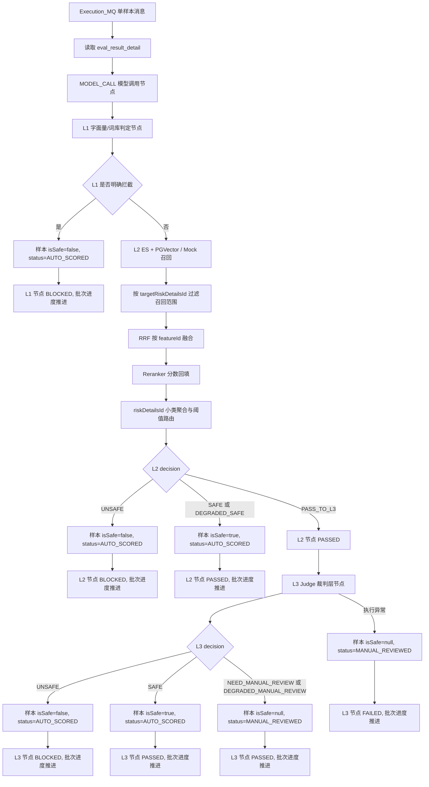
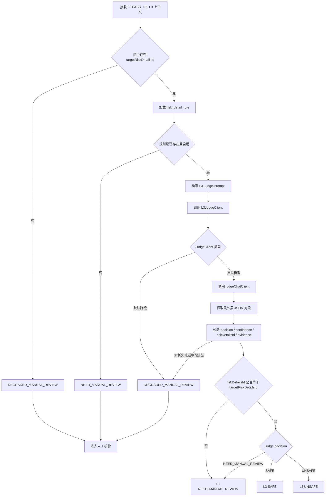
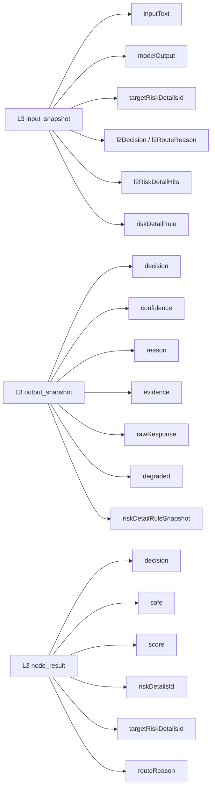

# L3 Judge 裁判层流程图

## 完整评测流水线

## L3 内部裁判流程

## L3 节点日志结构

## 当前阶段行为

- L3 只在 L2 `PASS_TO_L3` 时执行。
- 默认 `app.l3.judge-mode=real`，使用 `JudgeConfiguration` 中的 `judgeChatClient` 调用真实裁判大模型。
- 如需回到纯降级链路，可配置 `app.l3.judge-mode=default`，使用 `DefaultL3JudgeClient` 返回 `DEGRADED_MANUAL_REVIEW`。
- 模型调用异常、非 JSON、字段非法或证据不足时，样本进入 `MANUAL_REVIEWED`，批次进度正常推进。
- 即使后续真实 Judge 返回 `UNSAFE`，如果 `riskDetailsId` 与 `targetRiskDetailsId` 不一致，也会转为人工核验。
